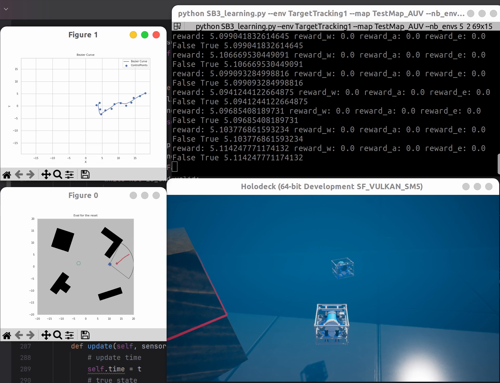

# RL_AUV_tracking

Using **reinforcement learning(RL)** to train **an AUV agent** to tracking the target in the unknown underwater scenario in **HoloOcean**(support for 2.0.0).

## 🛠️ Installation

1.  **Clone the repository:**
    ```bash
    git clone https://github.com/Ice-mao/RL_AUV_tracking.git
    cd RL_AUV_tracking
    ```

2.  **Create and activate the Conda environment:**

    We recommend using Ubuntu 20.04 with an Nvidia GPU (tested on 3060, 4090).
    ```bash
    # coming soon
    # conda env create -f environment.yaml
    # conda activate auv_env
    ```

3.  **Install Python packages:**
    ```bash
    pip install -r requirements.txt
    ```

4.  **Install inekf:**
    ```bash
    # Install inekf
    git clone https://github.com/mbrossar/inekf.git
    cd inekf
    python setup.py install
    cd ..
    ```

5.  **Install HoloOcean**
    Follow the official documentation to install HoloOcean 2.0.0 and download the Ocean packages:
    [HoloOcean Installation Guide](https://byu-holoocean.github.io/holoocean-docs/v2.0.0/usage/installation.html)

6.  **Set up HoloOcean Scenarios**
    Copy the scenario configuration files from `configs/json` to the HoloOcean worlds directory.
    ```bash
    scp -r configs/json/* ～/.local/share/holoocean/worlds/Ocean/
    ```

## 🌊 Environments

This project provides three Gymnasium-compatible environments for AUV target tracking:

### Environment Overview

| Environment | Observation Space | Action Space (LQR) | Action Space (PID) |
|-------------|-------------------|-------------------|-------------------|
| `AUVTracking_v0` | `Box(6)` | `Box(3)` | `Box(2)` |
| `AUVTracking_v1` | `Dict` | `Box(3)` | `Box(2)` |
| `AUVTracking_v2` | `Dict` | `Box(3)` | `Box(2)` |

### Detailed Observation Spaces

#### AUVTracking_v0
- **Observation Type**: `Box(6, dtype=float32)`
- **Components**: State vector `[target distance,target angle, 协方差行列式值, bool, closest obstacle distance, closest obstacle angle]`
- **Range**: `[-inf, inf]` for position, `[-π, π]` for angles

#### AUVTracking_v1
- **Observation Type**: `Dict`
- **Components**:
  - `'state'`: `Box(6, dtype=float32)` - AUV state vector
  - `'rgb'`: `Box((5, 3, 224, 224), dtype=uint8)` - RGB camera image
- **Ranges**:
  - State: `[-inf, inf]` for position, `[-π, π]` for angles
  - RGB: `[0, 255]` for pixel values

#### AUVTracking_v2
- **Observation Type**: `Dict`
- **Components**:
  - `'state'`: `Box(6, dtype=float32)` - AUV state vector
  - `'rgb'`: `Box((5, 3, 224, 224), dtype=uint8)` - RGB camera image
  - `'sonar'`: `Box((5, 1, 128, 128), dtype=uint8)` - Sonar depth map
- **Ranges**:
  - State: `[-inf, inf]` for position, `[-π, π]` for angles
  - RGB: `[0, 255]` for pixel values
  - Sonar: `[0, 255]` for pixel values

### Action Spaces

#### LQR Control
- **Action Type**: `Box(3, dtype=float32)`
- **Components**: Waypoint in the robot coordinate system:[$r$, $\theta$, $\gamma$]
- **Range**: $r$:`[0.0, 1.0]`,
others:`[-1.0, 1.0]`

#### PID Control
- **Action Type**: `Box(2, dtype=float32)`
- **Components**: [$v$, $\omega$]
- **Range**: `[-1.0, 1.0]` (normalized velocity commands)

### Usage

We provide two ways to use our environments:

#### Method 1: Direct Environment Creation

```python
import auv_env
env = auv_env.make("AUVTracking_v0", 
                   config=config,
                   eval=True, 
                   t_steps=200,
                   show_viewport=True)
```
**Parameters:**
- `config`: Configuration file from `configs/envs/` directory, use `config_loader.load_config` to parse the YAML.
- `eval`: Enable 2D visualization of the environment for debugging
- `t_steps`: Maximum episode steps
- `show_viewport`: Show HoloOcean 3D viewport, `False` for no display training.

#### Method 2: Gymnasium Registration

```python
import gymnasium as gym
import auv_env
env = gym.make("AUVTracking_v0")
```
Only with default config and eval and show_viewport are True.

<!-- ### Available Environment IDs
| Environment ID | Description |
|----------------|-------------|
| `v1-state` | Basic teacher environment with rendering |
| `v1-state-norender` | Teacher environment for fast training |
| `v1-Teacher-render` | Teacher environment with 2D visualization |
| `v2-Teacher` | Advanced teacher environment with multi-modal inputs |
| `v2-Teacher-norender` | Advanced teacher environment for training |
| `v2-sample-render` | Evaluation environment with rendering | -->


## 🚀 Quick Start

### Training

Start training with the provided script:

```bash
./train.sh
```

You can modify the training configuration by editing:
- **Environment config**: `configs/envs/<env_config>.yml` - Configure environment parameters
- **Algorithm config**: `configs/algorithm/<alg_config>.yml` - Configure RL algorithm settings

### Evaluation

After training is completed, the policy files will be saved. To evaluate a trained model:

1. Add your trained policy file to the `RESUME_PATH` directory
2. Run the evaluation script:

```bash
./eval.sh
```

This will load the trained policy and evaluate its performance in the environment.

### Simulation Process

<div align="center">

</div>

### Configuration Tips

- **Training Phase**: Disable `eval`, `render`, and `draw_traj` to increase training speed
- **Evaluation Phase**: Enable `eval`, `render`, and `draw_traj` to visualize model performance

## 📚 Codebase Tutorial

### Project Architecture

```
RL_AUV_tracking/
├── auv_env/                    # Core environment package
│   ├── envs/                  # Environment implementations
│   │   ├── base.py           # Base classes (TargetTrackingBase, WorldBase)
│   │   ├── world_auv_v0.py   # State-only environment
│   │   ├── world_auv_v1.py   # State + RGB environment  
│   │   ├── world_auv_v2.py   # State + RGB + Sonar environment
│   │   ├── agent.py          # Agent implementations (AUV, Target)
│   │   └── obstacle.py       # Obstacle detection and collision
│   ├── maps/                 # Map utilities and scenarios
│   └── wrappers/             # Environment wrappers
├── auv_control/              # Control and estimation modules
│   ├── control/              # Controllers (LQR, PID)
│   └── estimation/           # State estimation (KF, UKF, IEKF)
├── auv_track_launcher/       # Training algorithms and networks
│   ├── algorithms/           # RL algorithms (PPO, SAC, SQIL, etc.)
│   ├── networks/             # Neural network architectures
│   └── common/               # Training utilities and callbacks
├── configs/                  # Configuration files
│   ├── envs/                # Environment configurations
│   └── algorithm/           # Algorithm configurations
└── tests/                   # Test scripts and examples
```

### Core Components

#### 1. Environment Base Classes (`auv_env/envs/base.py`)

**`TargetTrackingBase`**: Main Gymnasium environment wrapper
- Handles environment lifecycle (reset, step, seed)
- Delegates actual simulation to `WorldBase` subclasses
- Manages episode counting and state tracking

**`WorldBase`**: Abstract base class for all underwater simulation environments
- HoloOcean simulation management
- Agent and target initialization with random positioning
- Sensor data processing and belief state tracking
- Collision detection and boundary checking
- Reward computation and episode termination

**Key Methods**:
```python
def step:  # Env step process
def build_models:  # Create agent and target model and belief
def reset:  # Env reset function
```

#### 2. Environment Variants

**AUVTracking_v0**: Basic state-based tracking
- Observation: 6D state vector (target distance, angle, belief covariance, etc.)
- Focus: Classical control and basic RL algorithms

**AUVTracking_v1**: Vision-enhanced tracking  
- Observation: Dict with state + RGB camera frames (5×3×224×224)
- Focus: Visual navigation and multi-modal learning

**AUVTracking_v2**: Full sensor suite
- Observation: Dict with state + RGB + sonar data (5×1×128×128)
- Focus: Robust underwater navigation with multiple modalities


#### 3. Key Features

**Belief State Tracking**: 
- Kalman Filter-based target tracking (`belief_targets`)
- Handles partial observability and sensor noise
- Maintains uncertainty estimates for decision making

**Randomized Initialization**:
- `get_init_pose_random()`: Generates valid agent/target positions
- Supports "insight" vs "no-insight" scenarios
- Ensures collision-free and bounded initial states

**Configuration-Driven Architecture**
- All parameters controlled via YAML files in `configs/`
- Runtime behavior modification without code changes
- Environment-specific and algorithm-specific configurations

### Adding New Environments
1. **Read `auv_env/envs/world_auv_v0/1/2.py`** 

2. **Create new environment class like them**:
```python
class WorldAuvCustom(WorldBase):
    def __init__(self, config, map, show):
        # Custom initialization
        super().__init__(config, map, show)
    
    def reset(self, seed=None, **kwargs):
        # Custom reset
        return super().reset(seed=seed, **kwargs)

    def set_limits(self):
        
    def update_every_tick(self, sensors):

    def state_func(self, observed, action):
        
    def get_reward(self, is_col, action):
```

2. **Register in `auv_env/__init__.py`**:
```python
world_map = {
    'AUVTracking_custom': (WorldAuvCustom, "YourHoloOceanMap"),
}
```

## 🏷️ License

This repository is released under the MIT license. See [LICENSE](LICENSE) for additional details.

## 🙏 Acknowledgement

Our [`auv_control`](./auv_control/) implementation is adapted from [`AUVControl`](https://github.com/contagon/AUVControl.git).

## 📝 TODO

- [ ] **Obs Encoder**: for v1 env training
- [ ] **Evaluation Metrics**: Implement detailed evaluation metrics for tracking performance.
- [ ] **Sample Data Collection and Imitation Learning Integration**: Develop pipelines for data collection and integrate imitation learning algorithms.
- [ ] **New Image Processing Algorithms**: Research and implement advanced image processing techniques for underwater environments.

**Please keep staying tuning 😊!**