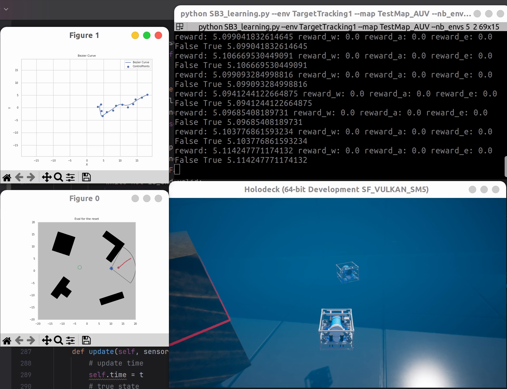

# RL_AUV_tracking

A project for my major related graduation paper.

Using reinforcement learning(RL) to train an agent to tracking the target in the unknown underwater scenario in HoloOcean.

# Running

To run the simulation, first install all dependencies

- HoloOcean
- Stable Baseline3
- pynput
- bezier
- filterpy
- inekf
- scipy
- sb3-contrib
- seaborn
- shapely

Then simply run the script
```
python SB3_learning.py --choice 0 --render 0
```
maybe you should also add --map with you own map or HoloOcean scenario like SimpleUnderwater-Hovering.

use auv target run the script
```
python SB3_learning.py --env TargetTracking1 --map TestMap_AUV --nb_envs 5 --choice 0 --render 0 
```
if you want to run in my scenario,you should add my config[TestMap.json](config%2FTestMap.json) in you World.

## Simulation Process



## Additional information

If you want to know more details,you should read the code.
:smile: 

Or please keep staying tuning!
